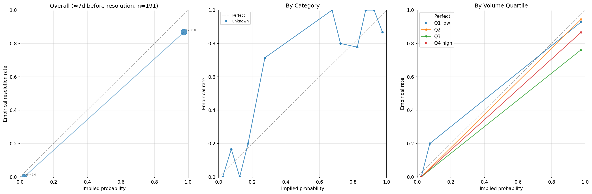
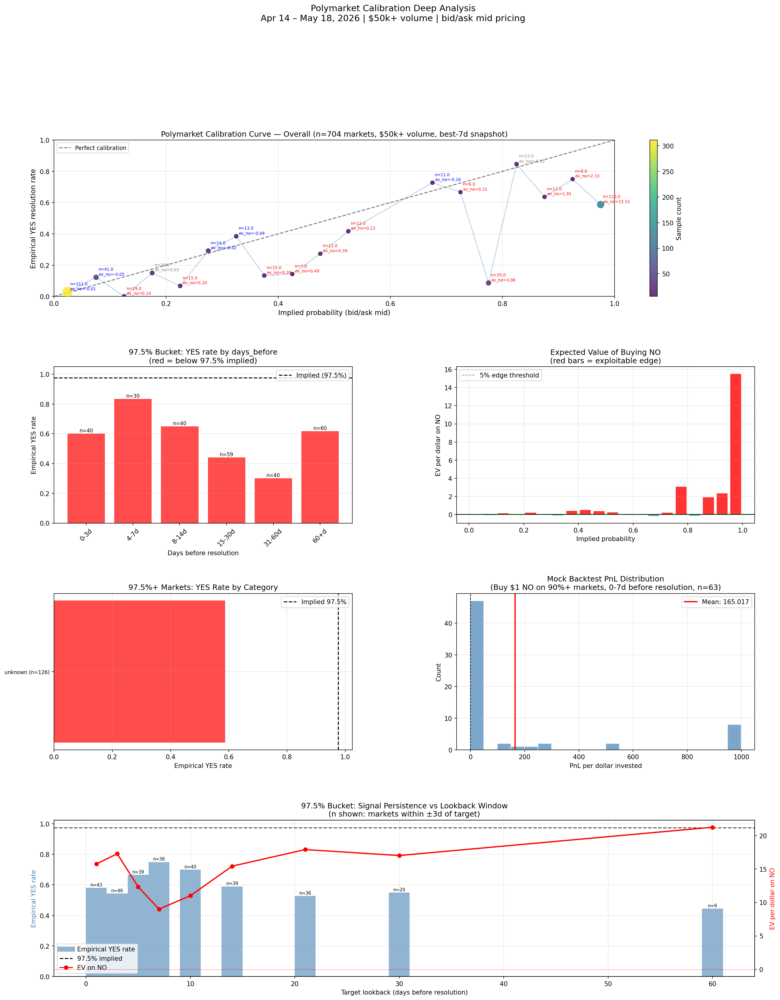
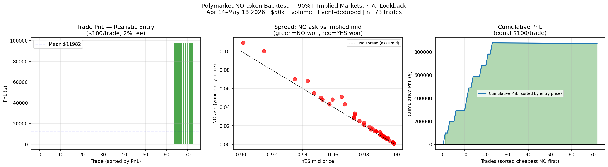

# Polymarket Calibration and Arbitrage Research

Independent research project looking for statistical inefficiencies in prediction markets. The core idea is that these markets are young enough, and do not have the hardware or colocation advantage that dominates equity high frequency trading, that a solo researcher can still find a real edge using public data and a laptop.

Five strategies were scoped out. Four were tested and killed once the data showed no durable edge after fees. One, a calibration curve approach, produced a statistically significant and economically large mispricing that was carried through a full backtest with realistic execution costs.

## Key finding

Markets priced at 97.5 percent or higher implied probability (the market treats an outcome as close to certain) resolved YES only about 59 percent of the time, not 97.5 percent. The long shot NO side won 41 percent of the time at a price of 2.5 cents, which is roughly 15 to 17 times the payout you would expect if the market were fairly priced. This holds up across a 50,000 dollar minimum volume filter, deduplication of correlated sub markets that belong to the same event, and multiple lookback windows.

A realistic backtest that accounts for actual bid and ask spreads and Polymarket's 2 percent taker fee narrows this edge considerably. That backtest is included in this repo (`backtest.py`) so the honest, cost adjusted version of the result is available alongside the optimistic one.







## Strategies explored

### 1. Cross platform arbitrage (Polymarket vs Kalshi), killed
Buy the same event's opposing side on two platforms to lock in a price spread. An overnight monitor found zero persistent opportunities once noise was filtered out. Round trip fees of roughly 3 to 4 percent require a wide spread to be worth trading, the two platforms do not cover the same events very often, and capital has to sit idle on both platforms at once to catch a divergence.

### 2. MECE arbitrage within one platform, killed
Some events are structured as mutually exclusive and exhaustive outcome sets, where the YES prices across all outcomes should sum to 1.00. If they do not, there is a theoretical guaranteed profit. A monitor for this is included in this repo (`arb_monitor.py`), but most raw hits turn out to be markets that only look mutually exclusive on the surface. Player prop markets, multi threshold crypto price markets, and open ended multi select markets can all show a price sum far from 1.00 without any real mispricing, because more than one outcome can independently be true. Restricting detection to markets Polymarket itself flags as `negRisk` (its own internal marker for a true mutually exclusive group) removes most of the false positives, but what is left mostly looks like thinly traded, not yet priced legs rather than a tradeable edge.

### 3. Informed trader or large bet detection, scoped but not built
Polymarket is fully on chain, so every trade is publicly visible in real time. The idea was to watch for bets that are unusually large relative to that specific market's liquidity, not unusually large in absolute terms, on the theory that some large bets reflect real information. The known risk is that a large bet can itself be manipulation, placed to attract followers before the position is exited.

### 4. Favorite long shot bias fading, explored, weak
A well known sports betting effect where bettors overpay for outcomes they are emotionally attached to, making favorites underpriced and long shots overpriced. This effect looks weaker on Polymarket than on a typical sportsbook, likely because Polymarket's user base skews more sophisticated. It might show up more clearly in political or cultural markets than in sports markets.

### 5. Calibration curve and statistical arbitrage, the one that worked
Take historically resolved markets, group them by their market implied price some fixed number of days before resolution, and compare that implied price to the actual resolution rate in each bucket. A market that is priced correctly on average should sit on the diagonal, where implied probability equals empirical frequency. A systematic gap away from the diagonal is a structural mispricing rather than a one time coincidence. This is the strategy that became the full pipeline described below.

## Pipeline

Three scripts, run in order.

### `calibration.py`
Parses about 35 days of hourly Polymarket order book snapshots in parallel, one worker per file, pulls resolved market outcomes from the Gamma API, joins prices to outcomes, deduplicates correlated sub markets from the same event, and builds the calibration curve segmented by category and volume quartile. Outputs `calibration_raw.csv`, `calibration_curve.csv`, and `calibration_curves.png`.

### `deep_analysis.py`
Eleven analysis sections that stress test whether the calibration anomaly is real. Breaks the high confidence bucket down by days before resolution, checks category concentration, computes expected value per dollar at every price bucket, splits by volume quartile to confirm the edge is not limited to illiquid markets, and sweeps the lookback window to see how the signal decays. Outputs `deep_analysis.png`.

### `backtest.py`
Pulls the actual bid and ask at each trade's snapshot instead of assuming a fill at the midpoint, applies Polymarket's 2 percent taker fee, and reruns the strategy at a flat 100 dollar position size per trade. Reports total return, win rate, and a break even table showing what win rate would be needed at each entry price. Outputs `backtest.png`.

## Arbitrage monitor (exploratory, strategies 1 and 2)

### `arb_monitor.py`
Polls Polymarket and Kalshi on an interval, checks for MECE deviations on each platform, and checks for cross platform price divergence on events matched by fuzzy title similarity. Kalshi requests are signed with RSA PSS. Requires the `KALSHI_KEY_ID` and `KALSHI_PRIVATE_KEY_PATH` environment variables, or pass `--skip-kalshi` to run Polymarket only. Writes `arb_log.jsonl` and `arb_summary.csv`.

### `analyze_results.py`
Filters `arb_summary.csv` against known false positive market structures, requires a minimum persistence across polling cycles, and ranks what survives into `arb_interesting.csv`.

## How to run

Install dependencies.

```
pip install -r requirements.txt
```

Get the price data. This project uses the PMXT v2 archive for hourly Polymarket order book snapshots. Download the parquet files you want into the repo root, named like `polymarket_orderbook_YYYY-MM-DDT00.parquet`. This data is not included in the repo because the full set used here is several gigabytes.

Run the calibration pipeline.

```
python calibration.py --snapshot-dir . --lookback 7 --min-volume 100000
python deep_analysis.py
python backtest.py
```

The first run of `calibration.py` will parse every snapshot file and fetch resolved markets from the Gamma API, which can take a while on the first pass. Results are cached to `prices_cache.parquet`, `gamma_cache.json`, and `clob_cache.json` so later runs are fast.

To try the arbitrage monitor without Kalshi credentials.

```
python arb_monitor.py --skip-kalshi --cycles 3 --interval-min 10
python analyze_results.py --min-cycles 2
```

## Data sources

| Source | What it provides | Access |
|---|---|---|
| PMXT v2 archive | Hourly Polymarket order book snapshots in parquet format | Free |
| Polymarket Gamma API | Resolved market metadata, outcomes, volume, category, event grouping | Free, no auth |
| Polymarket CLOB API | Explicit YES and NO token labeling per market | Free, no auth |
| Kalshi API | Markets, events, order book, used only for the cross platform strategy | Free, RSA PSS signed requests |

## Limitations

Only about 35 days of snapshot history were available at the time this was built, which limits statistical confidence relative to a longer window. Polymarket's category tagging is largely unpopulated upstream, so category level conclusions are weaker than volume based ones. Some NO side upsets in the highest confidence bucket are correlated even after deduplication, for example multiple award style markets tied to the same underlying real world event, which slightly overstates effective sample independence. Near certainty NO tokens priced at a few cents may be illiquid in practice, which is why the backtest pulls real bid and ask data instead of relying on the midpoint.

## License

MIT, see `LICENSE`.
